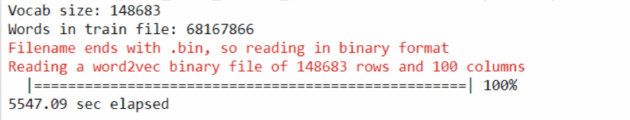

# Modelo 1: Red neuronal Base

En esta sección vamos a utilizar la paquetería de Benjamin Schmidt para entrenar una red neuronal que construye representaciones vectoriales de palabras (embeddings). Esta paquetería se encuentra en [https://github.com/bmschmidt/wordVectors](https://github.com/bmschmidt/wordVectors).

```{r, warning=FALSE, message=FALSE, eval=TRUE}
library(tidyverse)
library(tictoc)
library(knitr)
```

```{r, include = FALSE}
knitr::opts_chunk$set(eval = FALSE)
```

## Normalizacion de textos

* Leemos las listas con vectores que contienen líneas de guiones de películas separadas por género. Recordemos que:

    + `scripts_all.RDS` se construyó usando las listas de películas por género propuestos por [imsdb](http://www.imsdb.com/)
    + `scripts_less.RDS` se construyó agregando o eliminando listas de películas por género; ya sea por el tamaño de la lista o por que hacía sentido unirlas

```{r}
scripts_all <- read_rds("./datos/scripts_all.RDS")
scripts_less <- read_rds("./datos/scripts_less.RDS")
```

* Eliminamos las entradas vacíos.

```{r}
scripts_all <- lapply(scripts_all, function(x) x[x != ""])
scripts_less <- lapply(scripts_less, function(x) x[x != ""])
```

```{r}
scripts_all <- lapply(scripts_all, function(x) x[x != " "])
scripts_less <- lapply(scripts_less, function(x) x[x != " "])
```

* Obtenemos un único texto por género en cada lista.

```{r}
scripts_all <- lapply(scripts_all, 
                  function(x) paste(x, collapse = " "))
scripts_less <- lapply(scripts_less, 
                  function(x) paste(x, collapse = " "))
```

* Convertimos mayúsculas a minúsculas, identificamos inicios de oraciones y signos de puntuación.

```{r}
normalizar <- function(texto){
  texto <- tolower(texto)
  #texto <- gsub("\\.\\s", " _ss_ ", texto)
  texto <- gsub("\\.\\s*$", " _ss_", texto)
  texto <- gsub("\\.[^0-9]", " _ss_ _s_ ", texto)
  #texto <- gsub("[«»]", "", texto) 
  texto <- gsub("\\,[^0-9]", " _coma_ ", texto)
  texto <- gsub(";", " _punto_coma_ ", texto) 
  texto <- gsub("\\:", " _dos_puntos_ ", texto) 
  texto <- gsub("\\!", " _exclamacion_ ", texto)
  texto <- gsub("\\?", " _interrogacion_ ", texto)
  texto <- paste("_s_ _s_ ", texto)
  texto <- gsub("\\s+", " ", texto)
  texto
}
```

```{r}
#tic()
if (!file.exists("./datos/scripts_all_norm.RDS")) {
  scripts_all <- lapply(scripts_all, normalizar)
  write_rds(scripts_all, './datos/scripts_all_norm.RDS')
} else {
  scripts_all <- read_rds('./datos/scripts_all_norm.RDS')
}

if (!file.exists("./datos/scripts_less_norm.RDS")) {
  scripts_less <- lapply(scripts_less, normalizar)
  write_rds(scripts_less, './datos/scripts_less_norm.RDS')
} else {
  scripts_less <- read_rds('./datos/scripts_less_norm.RDS')
}
#toc()
```

<!-- ```{r} -->
<!-- words <- strsplit(scripts[['film_noir']], " ") -->
<!-- words.freq <- table(unlist(words)) -->
<!-- cbind.data.frame(words = names(words.freq), -->
<!--                  freq = as.integer(words.freq)) %>% -->
<!--   arrange(desc(freq)) -->
<!-- ``` -->
<!-- girl, love, great, star, guy, senator, police, dead, woman, father, murder, smile, work, club, kiss, music, real, play, home, husband, room, she, night, day, hate, kill, drink, boy, news -->

* Sustituimos palabras por labels deacuerdo a su género. Las palabras que elegimos fueron:
    + star
    + drink
    + kill
    + girl

```{r}
genre_label <- function(texto, genre){
  texto <- gsub(" star ", paste(" star", "_", genre, " ", sep = ""), texto)
  texto <- gsub(" drink ", paste(" drink", "_", genre, " ", sep = ""), texto)
  texto <- gsub(" kill ", paste(" kill", "_", genre, " ", sep = ""), texto)
  texto <- gsub(" girl ", paste(" girl", "_", genre, " ", sep = ""), texto)
  texto
}

for(genre in names(scripts_all)) {
  scripts_all[[genre]] <- genre_label(scripts_all[[genre]], genre)
}

for(genre in names(scripts_less)) {
  scripts_less[[genre]] <- genre_label(scripts_less[[genre]], genre)
}
```

## Entrenamiento

* Instalamos la paquetería `wordVectors`

```{r}
if (!require(wordVectors)) {
  if (!(require(devtools))) {
    install.packages("devtools")
  }
  devtools::install_github("bmschmidt/wordVectors")
}
```

* Terminamos de preparar el texto agregando todas las líneas de películas por género en un solo archivo.
    + Permitimos que se agreguen n-gramas frecuentes en una sola palabra. Elegimos n-gramas de hasta 2 palabras.

```{r, warning=FALSE}
dir.create("./datos/prep_all/")
for(genre in names(scripts_all)) {
  cat(scripts_all[[genre]], file = paste("./datos/prep_all/", genre, ".txt", sep = ""))
}

dir.create("./datos/prep_less/")
for(genre in names(scripts_less)) {
  cat(scripts_less[[genre]], file = paste("./datos/prep_less/", genre, ".txt", sep = ""))
}

if (!file.exists("./datos/scripts_all.txt")) prep_word2vec(origin="./datos/prep_all/",destination="./output/scripts_all.txt",lowercase=T,bundle_ngrams=2)

# if (!file.exists("./datos/scripts_less.txt")) prep_word2vec(origin="./datos/prep_less/",destination="./output/scripts_less.txt",lowercase=T,bundle_ngrams=2)
```

* Entrenamos la red usando todos los géneros de películas. Esto tomó tres horas.

```{r}
#tic()

if (!file.exists("./datos/scripts_all.bin"))
model_all <- train_word2vec("./datos/scripts_all.txt", 
                        "./datos/scripts_all.bin",
          vectors = 100, threads = 4, window = 4, cbow = 0,  
          iter = 5, negative_samples = 20, min_count = 5)

#toc()
```

* Algunas notas de la selección de parámetros:
    + `vectors` elegimos representaciones de palabras de longitud 100. Generalmente mayor longitud implica mayor precisión (pero no siempre)
    + `threads` utilizamos 4 procesadores de la máquina
    + `iter` se pasó por el corpus 5 veces
    + `cbow` utilizamos skip-grams
    + `window` la ventana sobre la que se hacen los skip-grams es 4. Pensamos que este es un número adecuado porque los diálogos en los guiones de las películas suelen ser frases cortas.
    + `negative_samples` número de negativos en las muestras que se toman en el entrenamiento por skipgram (para data sets pequeños se recomienda un mayor número de negativos) 
    + `min_count` usamos un mínimo de 5 veces que una palabra debe aparecer para ser parte de las muestras

    
<!-- the training algorithm: hierarchical softmax (better for infrequent words) vs negative sampling (better for frequent words, better with low dimensional vectors) -->

* Entrenamos otra red utilizando los géneros de películas simplificados. Usamos los mismos parámetros.

```{r}
#tic()

if (!file.exists("./datos/scripts_less.bin"))
model_less <- train_word2vec("./datos/scripts_less.txt", 
                        "./datos/scripts_less.bin",
          vectors = 100, threads = 4, window = 4, cbow = 0,  
          iter = 5, negative_samples = 20, min_count = 5)

#toc()
```

Para esta red neuronal se utilizó: 

* un vocabulario de 150,000 palabras aprox
* un total de palabras de 68 millones en el archivo de entrenamiento

```{r out.width = "75%", eval=TRUE}

```

# Modelo 2: Los 100 Sustantivos más Comunes y sus Contrastes por Género

En esta sección buscamos ampliar el modelo anterior incluyendo más palabras distinguidas entre géneros. Para escoger las palabras, creamos un script que identifica los 100 sustantivos más comunes en los scripts, excluyendo cualquier "stopword". Para esto usamos la libreria `tm` (textmining), y `RDRPOSTagger` (part-of-speech tagging). Para cada palabra de esta lista comparamos las distancias entre géneros, y para los dos géneros con mayor distancia, buscamos las palabras asociadas que no sean comunes. Esto permite distinguir el uso de palabras en ambos géneros. Adicionalmente, vamos a ver cómo podemos usar esta lista de palabras para crear y visualizar las distancias entre géneros usando escalamiento multidimensional (MDS).

## Los 100 sustantivos más comunes entre scripts

```{r}
library(tidyverse)
library(wordVectors)
library(tm) # text mining
# devtools::install_github("bnosac/RDRPOSTagger")
library(RDRPOSTagger) # Identifica sustantivos
library(wordVectors)
library(tictoc)
```

Ahora encontramos los 100 sustantivos más comunes en el texto

```{r}
punctuation <- c("_s_", "_ss_", "_coma_", "_punto_coma_", "_interrogacion_", 
                 "_dos_puntos_", "_exclamacion_", "-", "--")

wordcount <- scripts %>%
  str_split(" ") %>% # split long strings into vectors
  reduce(c) %>% # create single character vector
  table() %>% # count
  as.data.frame(stringsAsFactor = FALSE) # creates data with columns: words and frequencies
names(wordcount) <- c("word", "count") # better name for the columns

tagger <- rdr_model(language = "English", annotation = "POS")

top100nouns <- wordcount %>% # only keeping 100 because tagPOS takes time to run
  filter(! word %in% c(punctuation, stopwords())) %>% # remove common words
  arrange(desc(count)) %>%  # order in frequency %>%
  slice(1:500) %>%
  mutate(tag = map_chr(word, ~ rdr_pos(tagger, x = .x)$pos[1])) %>%
  filter(tag == "NN") %>% # keep only nouns
  slice(1:100)
```

```{r, eval=TRUE, include = FALSE, warning=FALSE, message=FALSE, results='hide'}
library(wordVectors)
load("./rmddata.RData")
top100nouns$word <- as.character(top100nouns$word) 
model <- wordVectors::read.binary.vectors("scripts100.bin")
```

Estos son los 100 sustantivos más comunes entre los scripts

```{r, eval=TRUE}
top100nouns$word
```

Al igual que antes vamos a modificar los scripts de manera que cada palabras sea susituida por `palabra_genero`


```{r}
tic()
key_words <- c(c("star", "drink", "kill", "girl", "kiss", "reality"), top100nouns$word)
for(genre in names(scripts)) {
  scripts[[genre]] <- genre_label(scripts[[genre]], genre, key_words)
}
toc()
```

## Entrenamiento 

```{r}
for(genre in names(scripts)) {
  cat(scripts[[genre]], file = paste("./prep/", genre, ".txt", sep = ""))
}

tic()
prep <- prep_word2vec("./prep/", destination = './output/scripts100.txt', bundle_ngrams = 2)
toc()
```


```{r}
tic()
model <- train_word2vec("./output/scripts100.txt", "./output/scripts100.bin",
          vectors = 100, threads = 4, window = 4, cbow = 0,
          iter = 5, negative_samples = 20, min_count = 5)
toc()
```

## Uso distinto de palabras por género

Ahora vamos a crear una tabla en la que muestra por cada palabra los usos más distintos entre géneros, encontrados palabras asociadas no comunes entre ambas, usando los vectores de palabras. El primero paso es crear una matriz de distancias por cada palabra entre todos los géneros. Después para la pareja de mayor distancia, usamos la funciòn `closest_to` para encontrar palabras asociadas, y luego encontramos las diferencias en uso.


Lista con matriz de distancias:

```{r}
genres <- names(scripts)
nwords <- length(key_words)
ngenres <- length(genres)
distances <- vector("list", nwords)
names(distances) <- key_words
for (word in key_words) {
  word_set <- paste0(word, "_", genres)
  mat <- matrix(0, ngenres, ngenres, dimnames = list(genres, genres)) 
  maxim <- c(genres[1], genres[2])
  max <- 0
  for (i in 1:(ngenres - 1)) {
    for (j in (i + 1):ngenres) {
      d <- cosineDist(model[[word_set[i]]], model[[word_set[j]]])
      mat[i, j] <- mat[j, i] <- d
      if (d > max) {
        max <- d
        maxim <- c(genres[i], genres[j])
      }
    }
  }  
  distances[[word]][["mat"]] <- mat
  distances[[word]][["max"]] <- maxim
}
```

Buscar palabras asociadas comunes y no comunes para los géneros más distantes (por palabra clave)

```{r}
df <- data_frame(
  word = key_words,
  genre1 = character(nwords), 
  genre2 = character(nwords),
  distance = numeric(nwords),
  in1not2 = character(nwords),
  in2not1 = character(nwords),
  common = character(nwords),
  different = character(nwords),
  set1 = character(nwords),
  set2 = character(nwords)
)

symdiff <- function( x, y) { setdiff( union(x, y), intersect(x, y))}

for (i in 1:nwords) {
  df$genre1[i] <- distances[[key_words[i]]]$max[1]
  df$genre2[i] <- distances[[key_words[i]]]$max[2]
  df$distance[i] <- distances[[key_words[i]]]$mat[df$genre1[i], df$genre2[i]]
  set1 <- model %>% 
    closest_to(paste0(df$word[i], "_", df$genre1[i]), 50) %>% 
    .$word %>% 
    discard(grepl(paste(genres, collapse="|"), .))
  set2 <- model %>% 
    closest_to(paste0(df$word[i], "_", df$genre2[i]), 50) %>% 
    .$word %>% 
    discard(grepl(paste(genres, collapse="|"), .))
  df$set1[i] <- paste(set1, collapse = ", ")
  df$set2[i] <- paste(set2, collapse = ", ")
  df$in1not2[i] <- paste(set1[!set1 %in% set2], collapse = ", ")
  df$in2not1[i] <- paste(set2[!set2 %in% set1], collapse = ", ")
  df$common[i] <- paste(intersect(set1, set2), collapse = ", ")
  df$different[i] <- paste(symdiff(set1, set2), collapse = ", ")
}
```

Podemos ver algunas menciones honoríficas de resultados interesantes

```{r, eval = TRUE}
df %>% 
  filter(word %in% c("girl", "car", "god", "life", "gun")) %>% 
  select(word, genre1, genre2, in1not2, in2not1) %>% 
  kable()
```

## Visualización de distancias entre géneros

Ahora podemos crear centroides por cada género sumando los vectores de cada género. Después usamos las distancias de coseno entre los centroides.

```{r, eval = TRUE}
# Obtain centres
centre <- vector("list", ngenres)
names(centre) <- genres
for (i in 1:ngenres) {
  word_set <- paste0(key_words, "_", genres[i])
  vec <- model[[word_set[1]]]
  centre[[i]] <- word_set %>% 
    map(~ model[[.x]]) %>% 
    reduce(`+`) 
}
genre_dist <- matrix(0, ngenres, ngenres, dimnames = list(genres, genres))
for (i in  1:(ngenres - 1)) {
  for (j in (i + 1):ngenres) {
    d <- cosineDist(centre[[i]], centre[[j]])
    genre_dist[i, j] <- genre_dist[j, i] <- d
  }
}
```

Para visualizar las distancias usamos escalamiendo multidimensional (MDS) con la función base de R `cmdscale`. El input de esta función es una matriz de distancias y el output es una matriz de coordenadas que buscan preservar estas distancias.

```{r, fig.width = 6, fig.height=4.5, eval=TRUE}
fit <- cmdscale(genre_dist, eig = TRUE, k = 2)
ggdata <- data.frame(
  x = fit$points[, 1],
  y = fit$points[, 2],
  label = genres
)
ggplot(ggdata, aes(x = x, y = y, label = label)) +
  geom_point() +
  geom_text(hjust = 0, nudge_y = 0.01, size = 3) +
  xlim(min(ggdata$x) - .05, max(ggdata$x) + 0.05) +
  labs(x = "Latente 1",
       y = "Latente 2",
       title = "Distancia entre generos",
       subtitle = "Escalamiento multidimensional usando sumas de vectores de palabras por genero")
```


**Referencias**

* [https://code.google.com/archive/p/word2vec/](https://code.google.com/archive/p/word2vec/)
* [Tomas Mikolov, Kai Chen, Greg Corrado, and Jeffrey Dean. Efficient Estimation of Word Representations in Vector Space. In Proceedings of Workshop at ICLR, 2013](https://arxiv.org/pdf/1301.3781.pdf)