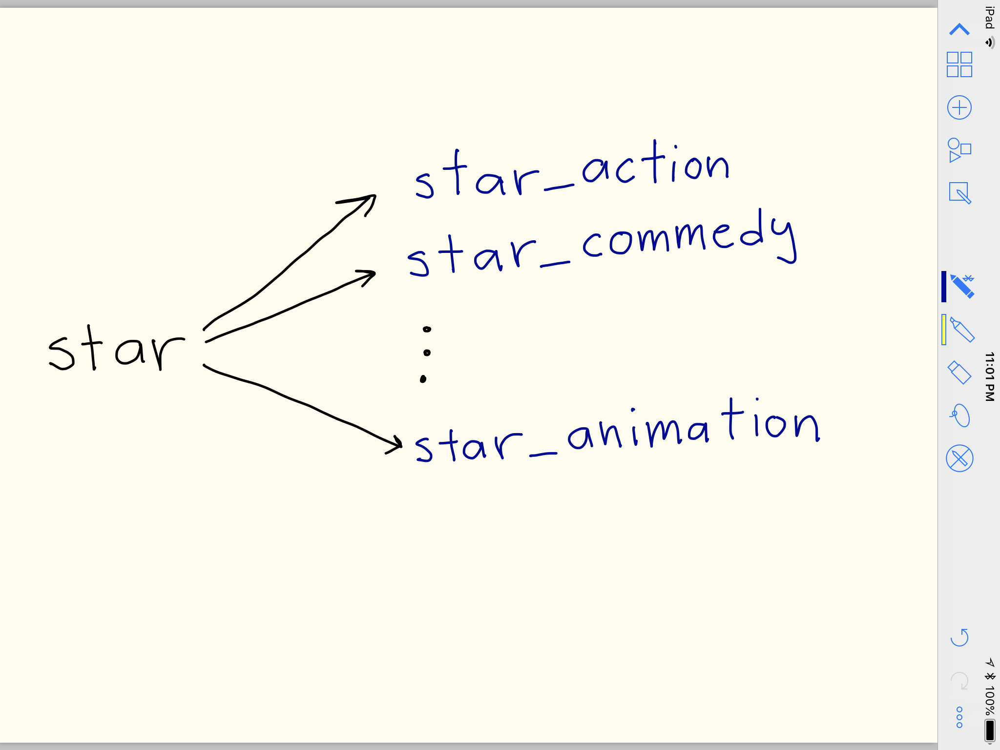

# Proyecto Final Métodos Analíticos 2018

En este trabajo buscamos describir las diferencias en el uso de una misma palabra en películas de acuerdo a su género.  

Para esto, contamos con un corpus de guiones de películas (~1,750) que se encuentran clasificadas por género.

La idea consiste en reemplazar una palabras seleccionada, digamos STAR, por una etiqueta exclusiva al género en donde se encuentra la palabra, digamos STAR_ACTION, STAR_COMEDY, STAR_ANIMATION, ...

## Contenido

* [01-descarga.html](https://audiracmichelle.github.io/proyecto_final_metodos_analiticos/01-descarga.html)
* [02-modelo.html](https://audiracmichelle.github.io/proyecto_final_metodos_analiticos/02-modelo.html)
* [03-representacion.html](https://audiracmichelle.github.io/proyecto_final_metodos_analiticos/03-representacion.html)
